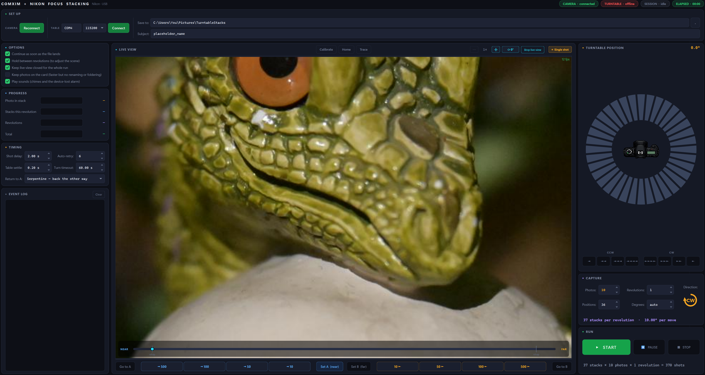

# Turntable Focus-Stack Bridge

Links a Nikon camera to a ComXim programmable turntable and drives both over
USB, so a full focus-stacked turntable shoot runs unattended — every focus
plane at every rotation position, without touching either device.



The camera is driven over **raw PTP**, not through any vendor SDK or
middleware. Every focus move is confirmed by the body before the next one is
issued, and every frame is pulled straight out of the camera's buffer, so
nothing depends on a card being present or on a helper application staying
alive overnight.

> **If the turntable will not connect to this app**, install ComXim's own
> TurntableX from <https://comxim.com/softwareapps-demo/>, connect to the
> turntable with that, then close TurntableX and try `TurntableBridge.exe`
> again. If that does not do it, close both, try again, and cross your fingers.
> Then double-check the COM number and the port.

---

## What you need

* **Windows**, 64-bit. The app uses `winsound` and serial COM ports.
* A **Nikon camera** on USB, bound to **WinUSB** — see [Setting up the
  camera](#setting-up-the-camera-zadig) below. Developed and measured against a
  **Z 6_2**; other Nikon bodies speak the same PTP dialect but have not been
  tested.
* The lens left in **autofocus (AF)**. The focus motor only accepts commands in
  AF. Every frame is fired with autofocus suppressed, so the plane the stack
  set is the plane that gets photographed.
* A **ComXim turntable** on a COM port.
* **Python 3.9–3.13**, to run from source or build the .exe. A finished .exe
  needs nothing installed.

---

## Setting up the camera (Zadig)

Windows claims the camera with its own MTP driver the moment you plug it in,
and holds it. That driver does not expose the PTP operations this app needs, so
the camera has to be rebound to **WinUSB** first. This is a one-time step per
camera body.

**While the camera is on WinUSB, Explorer will not see it as a device.** That is
expected and is not a fault — the camera stops being a drive and becomes
something only this app talks to. [Undoing it](#putting-the-camera-back) takes
about a minute.

1. Download **Zadig** from <https://zadig.akeo.ie>. It is a single portable
   .exe and does not install anything.
2. Plug the camera in and switch it on. Leave it on and awake for the next
   steps.
3. Run Zadig **as administrator** (right-click → *Run as administrator*).
   Replacing a driver needs it, and without it Zadig fails at the last step.
4. **Options → List All Devices.** The camera will not appear until you do
   this.
5. Pick the camera in the dropdown. It shows under its model name — on a
   Z 6_2, USB ID **04B0:044C**. `04B0` is Nikon's vendor ID and is the reliable
   half; the second half varies by body.
6. Set the target driver — the box to the right of the green arrow — to
   **WinUSB**.
7. Click **Replace Driver** and wait for it to report success.

Start the app and press **Connect** under *Camera*. The pill along the top
turns green and reports the model.

### If it does not connect

* **"No Nikon USB device found"** — the camera is off, asleep, or unplugged.
  Nikon bodies sleep aggressively on USB; switch it off and on again.
* **"Access denied"** — something else is holding the interface. The usual
  cause is another copy of this app still running. Close it and retry.
* **Camera still visible in Explorer** — the driver was not replaced. Re-run
  Zadig as administrator and check step 4 was done.

### Putting the camera back

To return the camera to a normal Windows device — for card transfers, tethering
software, or anything else that expects MTP:

1. Open **Device Manager**.
2. Find the camera. After Zadig it usually sits under **Universal Serial Bus
   devices** rather than *Portable Devices*.
3. Right-click it → **Update driver**.
4. **Browse my computer for drivers** → **Let me pick from a list of available
   drivers on my computer**.
5. Choose **MTP USB Device** and click Next.

Unplug and replug the camera. Explorer will see it as a device again, and this
app will no longer be able to open it until you redo the Zadig step.

---

## Install and run

Go to the releases page to find the .exe
https://github.com/Cmonsta6/turntable_bridge/releases

Otherwise, you can run it via python 

```bash
pip install -r requirements.txt
```

```bash
python turntable_app.py
```

Or build a standalone .exe that needs no Python on the machine that runs it —
see [Building an .exe](#building-an-exe).

---

## Using it

**1. Connect.** Enter the turntable's COM port in *Set up* and press both
Connect buttons. The camera needs no address; it is found over USB. The pills
along the top turn green as each device answers.

**2. Set the focus range.** Focus here is *relative* — the camera reports no
absolute lens position over PTP — so you define the range by hand. Jog the lens
to the nearest point you want sharp and press **Set A**, jog to the farthest and
press **Set B**. Both sit in the middle of the control row under the preview,
with the jog arrows either side and *Go to A* / *Go to B* at the ends. The track
floating over the bottom of the live image shows where the lens sits between
them.

**3. Describe the run.** In *Capture*: **Photos** is how many focus planes to
capture between A and B. **Positions** and **Degrees** are two views of one
number — fill in either and the other switches to `auto` and follows. A value
that does not divide 360 rounds the position count up, so the circle always
closes. **Direction** is the little circular arrow; click it to reverse.

**4. Start.** The header shows a live shot count and elapsed time, the dial
shows where the table is, *Progress* fills, and the log records every step.

You get **positions + 1** stacks per revolution: one at the start position and
one after each move, so the final stack lands back where it began.

Files land in:

```
<base folder>/<subject>/<subject>_rev-1/<subject>_rev-1_pos-001/
    <subject>_rev-1_pos-001_shot-0001.NEF
```

Every frame names its own three coordinates — which revolution, which position
on the table, which shot in the focus stack — so it still says where it came
from after it has been dragged out of its folder into a stacker or exported
flat. A file is exactly its folder's name plus `_shot-NNNN`, so the two can
never drift apart.

Position and shot are zero-padded and sort correctly; the revolution is not, so
pool revolutions into one directory and `rev-10` sorts before `rev-2`.
Re-captured stacks keep their `_recaptured` tag, ahead of the shot number. The
extension is whatever the camera sends — `.NEF` on a Nikon; nothing here
converts to DNG.

Folders were once spelled `_rev1` / `_pos001`, without the hyphens. A run
**recovered** into a session shot that way carries on writing into the folders
it already filled rather than starting a second tree beside them; only the
filenames inside are current. Nothing is renamed or moved.

### Things worth knowing

**⟳ rotates the preview**, for a camera mounted in portrait. The body streams
live view in its own sensor orientation and never reports which way up it is
bolted, so a camera on its side sends an ordinary landscape frame with the
subject lying down in it. Click to step 0° → 90° → 180° → 270° → 0°; the button
shows the current angle, and it is remembered between sessions because the
camera stays mounted. It needs no camera connected, so you can set it in advance.

This is a **display setting only** — saved photos are the camera's own bytes and
are never rotated or re-encoded by it. The window re-arranges itself to match:
at 90° or 270° the Set up panel moves into the left column so a portrait frame
gets the full window height, and at 0° or 180° the wide layout comes back. The
swap is live, works mid-run, and keeps every setting. With no camera connected
the preview draws a dashed outline of where the frame will sit.

**Single shot**, at the right-hand end of the live-view header, takes one photo
immediately. The table does not turn and the focus does not move — it captures
exactly what the preview is showing, which makes it the test exposure for
checking the light, the framing and the focus plane before committing to a run.
Frames land in `<base folder>/<subject>_singleshots/`, numbered, and never
overwrite an earlier one. That folder sits *beside* `<subject>/` rather than
inside it, so a test frame is never mistaken for part of a stack, and a single
shot is always pulled to the PC even with *Keep photos on the camera card*
ticked — otherwise there would be nothing in the folder to look at.

**Most settings are live.** Change a timing mid-run and it takes effect on the
next use. The exceptions are the ones that would be incoherent applied halfway:
*Keep photos on the card* and *Keep live view closed* are read once at the start
of a run, and the rotation geometry is fixed for the duration of each
revolution. The log says which scope a change applies at.

**Return to A** decides how the lens gets back after a stack. *Serpentine* does
not return at all — it shoots the next stack far-to-near instead and renumbers
its files to match, halving the focus travel. *Direct* makes one move back to A.
Once the lens has been calibrated both anchor on the near mechanical stop, so a
stack always starts in the same physical place.

**It tells you when the lens runs out of travel.** If a focus move hits a
mechanical stop mid-stack, the log says so in red rather than quietly shooting
several frames on the same plane. If you see it on every stack, A or B is set
past the end of the lens.

**It recovers from drop-outs.** If the camera is unplugged or the table stops
answering, the run pauses, sounds an alarm and waits for the device to come back online. A checkpoint is written at every stack, so an
interrupted run can be resumed with **Recover**.

**STOP escalates if the run does not hear it.** Stop normally just asks the run
to finish what it is doing and end, which takes a fraction of a second. If the
run is instead stuck in a device call that is not coming back, pressing Stop
again — or waiting four seconds — cuts the turntable's serial port out from
under it, which forces the stuck call to return and lets the run end through its
ordinary Stop path. The last stack's checkpoint is intact, so **Recover** carries
on from there: reconnect the table first. The camera is deliberately left alone,
because every camera call already has a timeout and unwinds on its own.

**Both Reconnect buttons keep working while a run is paused** — whether you
pressed Pause or a revolution ended on a hold. Each re-opens that device's link
in place without ending the run, which is what you want for a knocked USB cable
or a table that needs a power cycle. Press Resume when the device is back.

They come alive a *moment* after Pause, not instantly, and that moment is the
run finishing the frame or the move it was on: pausing asks the run to stop, and
until it actually stops, reconnecting would close the link mid-command. The COM
port and baud fields stay locked, because a mid-run reconnect can only reopen
the device the run started on — moving the table to a different port needs Stop
and then Recover. During an automatic drop-out wait the buttons stay off, since
that loop is already reconnecting by itself every second and a half.

**Keep photos on the camera card** skips the USB download and is much faster,
but nothing reaches the PC — so those files are not renamed or foldered, and the
app cannot verify focus against them.

**Keep live view closed for the whole run** shuts the sensor down for the
duration. This is not a speed setting: the on-screen preview stops polling
during a run either way. What it saves is the sensor and the live-view pipeline
running for the hours a run takes — heat and battery. It genuinely holds for the
whole run; focus and capture both work with live view down, measured on the
Z 6_2.

**The turntable speed buttons are toggles.** Click one to start a free spin,
click the lit one to stop, click a different one to change speed. The lit button
is the readout — it says which way the table is turning and how fast.

**The window has no minimum size.** Drag it smaller and the panels tighten
normally; past the point where the layout has nothing left to give, the whole
interface scales down as one piece rather than growing scrollbars.

---

## Sounds

Three .wav files in the project root, played by filename, so you can swap one by
replacing the file.

| File | Plays when | Repeats |
| --- | --- | --- |
| `chime_done.wav` | every revolution is finished | once |
| `chime_hold.wav` | a revolution ended and it is waiting for you | once |
| `chime_alarm.wav` | a device dropped out mid-run | **loops** until it is back |

All three are gated by the **Play sounds** checkbox, including the alarm. If a
file is missing the app synthesises the tune rather than running silent.

---

## Building an .exe

```bash
pip install -r requirements-dev.txt
```

```bash
python -m PyInstaller --noconfirm turntable_app.spec
```

| | Size | First window | Result |
| --- | --- | --- | --- |
| one file (default) | 46 MB | 1.4 s | `dist/TurntableBridge.exe` |
| one folder | 115 MB | 0.8 s | `dist_folder/TurntableBridge/` |

For the folder build set `TTB_ONEDIR=1` and pass `--distpath dist_folder`. Set
`TTB_CONSOLE=1` on either to keep a terminal attached, which is the only way to
see a crash that happens before the window exists.

### Sharing it

The Python side really is self-contained: CPython, Qt, pyserial, pyusb, the
bundled libusb, the MSVC runtime and every asset are inside the bundle.

What the other machine still needs is **64-bit Windows**, a **USB-serial
driver** for the turntable, and the camera **bound to WinUSB via Zadig** — the
.exe cannot do that part for you. It is unsigned, so the first launch shows
SmartScreen's *"Windows protected your PC"*; choose *More info* → *Run anyway*.

**Antivirus may flag the one-file build.** That is a known false positive: its
self-extracting bootloader resembles the packers real malware uses. The
one-folder build has no such stub and is flagged far less often. An exclusion
also works, and code-signing is the only fix that travels to other machines.
Do not add UPX compression — it makes detection *more* likely.

### The icon

`app_icon.ico` is built from `camera.png` by `tools/make_icon.py`. The artwork is
a black camera that disappears on a dark taskbar, so the icon composites it onto
a light plate. Pass `--plain` to skip that.

```bash
python tools/make_icon.py
```

---

## How the code is organised

```
turntable_app.py       launcher
turntable_app.spec     PyInstaller build definition
tools/make_icon.py     regenerates app_icon.ico
turntable/
  hardware/            device clients and focus maths — imports no Qt
  run/                 the capture worker thread and its mixins
  ui/                  theme, widgets, and the main window
  assets.py            finds camera.png and the .wav files in both source
                       and frozen builds
```

`hardware/` has no Qt dependency and can be driven headlessly.

**Read the docstrings before changing behaviour.** Each module's docstring
carries the reasoning behind anything non-obvious in it — the turntable's resend
hazard, why the PTP transport takes one transaction at a time, why recovery
assumes the worst. Most of them record a bug that was expensive to find, and
several record a belief that was measured and turned out to be wrong. Where a
comment cites a number, that number was measured on the rig rather than guessed.

## License

[MIT](LICENSE).
